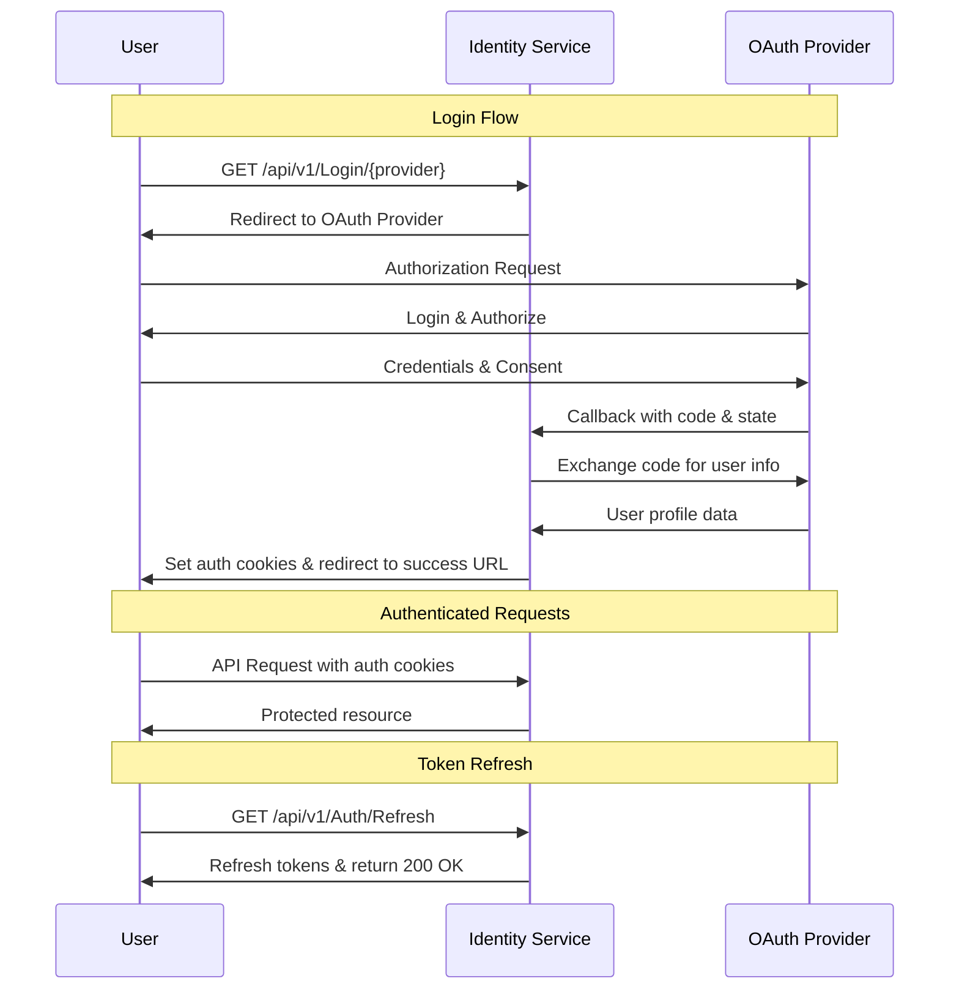

<div align="center">

# 🔐 Identity Service

**A modern OAuth 2.0 identity provider built with ASP.NET Core**

[](https://dotnet.microsoft.com/)
[](https://www.postgresql.org/)
[](LICENSE)

</div>

---

## 📖 Overview

Identity Service is a secure, production-ready OAuth 2.0 identity provider that enables seamless authentication and authorization for your applications. Built with ASP.NET Core, it provides JWT-based session management, multi-provider OAuth support, and a RESTful API for easy integration.

### ✨ Key Features

| Feature                         | Description                                            |
|---------------------------------|--------------------------------------------------------|
| 🔑 **Multi-Provider OAuth**     | Discord, GitHub, and Test (development) authentication |
| 🎫 **JWT Authentication**       | Secure token-based auth with access & refresh tokens   |
| 🍪 **Cookie Management**        | Automatic cookie handling for web applications         |
| 🔄 **Token Refresh**            | Built-in refresh mechanism for maintaining sessions    |
| 🗄️ **PostgreSQL Database**     | Persistent storage for users, logins, and tokens       |
| 🛡️ **Domain Whitelisting**     | CORS configuration with secure domain whitelisting     |
| 💚 **Health Checks**            | Built-in monitoring endpoints                          |
| 📚 **OpenAPI/Scalar**           | Interactive API documentation                          |

---

## 🔄 Authentication Flow

The following diagram illustrates the OAuth authentication flow:



---

## 🚀 Getting Started

### Prerequisites

- [.NET 10.0 SDK](https://dotnet.microsoft.com/download)
- [Docker](https://www.docker.com/get-started) (for PostgreSQL)
- [Entity Framework Core CLI](https://docs.microsoft.com/en-us/ef/core/cli/dotnet)

### 🐘 Database Setup

**1. Create the database volume directory:**

```bash
C:\DockerVolumes\Database
```

**2. Start PostgreSQL container:**

```bash
docker run -d \
  --name postgres-db \
  -e POSTGRES_USER=admin \
  -e POSTGRES_PASSWORD=admin123 \
  -e POSTGRES_DB=mydatabase \
  -v C:/DockerVolumes/Database/postgres-data:/var/lib/postgresql/data \
  -p 5432:5432 \
  postgres:17
```

### 🛠️ Entity Framework Setup

**Install or update EF Core CLI:**

```bash
# Install
dotnet tool install --global dotnet-ef

# Or update
dotnet tool update --global dotnet-ef
```

**Create a migration:**

```bash
dotnet ef migrations add InitialCreateIdentity --project ./App
```

**Apply migrations to database:**

```bash
dotnet ef database update --project ./App
```

---

## 🧪 Testing & Development

### Test Authentication Endpoint

Use the Test provider for local development:

```
http://localhost:5220/api/v1/Auth/Login/Test?SuccessRedirectUrl=http%3A%2F%2Flocalhost%3A5220%2Fscalar&ErrorRedirectUrl=http%3A%2F%2Flocalhost%3A5220%2Fscalar
```

### Expose Local Server with ngrok

For testing OAuth callbacks with external providers:

```bash
ngrok http http://localhost:5220
```

---

## 📡 API Endpoints

| Endpoint                              | Method | Description                  |
|---------------------------------------|--------|------------------------------|
| `/api/v1/Auth/Login{provider}`        | GET    | Initiate OAuth login flow    |
| `/api/v1/OAuth/Authorize/{provider}`  | GET    | OAuth callback endpoint      |
| `/api/v1/Auth/Refresh`                | GET    | Refresh access token         |
| `/api/v1/Auth/Logout`                 | DELETE | Logout and invalidate tokens |

**Supported Providers:** `Discord`, `GitHub`, `Test`

---

## 📝 License

This project is licensed under the MIT License - see the [LICENSE](LICENSE) file for details.

---

<div align="center">

**Built with ❤️ using ASP.NET Core**

</div>